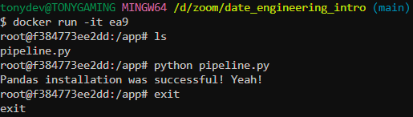

# Data Engineering intro

#### builds *image* based on **dockerfile**
```bash
docker build -t pypan_3.11.1:bash .
```

#### run a container based on image -> enter into bash
```bash
docker run  -it pypan_3.11.1:bash
```

#### copy local python script into containers /app folder
```dockerfile
FROM python:3.11.1
RUN pip install pandas
WORKDIR /app
COPY pipeline.py pipeline.py
ENTRYPOINT ["bash"]


### some python script
```python
# pipeline.py
import pandas as pd
# But the import alone makes sure Pandas is being installed properly
print("Pandas installation was successful! Yeah!")
```

#### inside container screenshot:



### testing list
1. how are ya
2. i'm great you
3. yeh not bad


